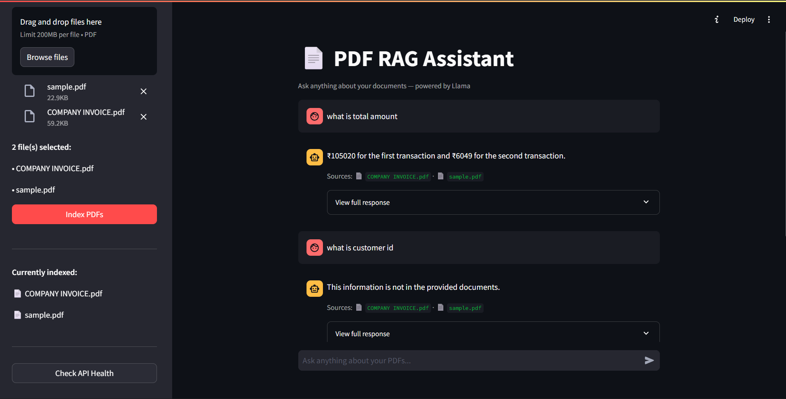

# 🧠 Intelligent Document Processing (IDP) System


## 🚀 Overview

The **Intelligent Document Processing (IDP) System** is an AI-powered application that extracts and answers questions from unstructured PDF documents using a **Retrieval-Augmented Generation (RAG)** pipeline.

It combines **semantic search, rule-based extraction, and LLM reasoning** to deliver accurate, context-aware answers from multiple documents.

---

## ✨ Features

* 📄 Multi-PDF upload and processing
* 🔍 Semantic search using embeddings
* 🧠 AI-powered question answering (LLM-based)
* ⚡ Hybrid pipeline (Rule-based + LLM) for high accuracy
* 📌 Source citation tracking (which file the answer came from)
* 💬 Interactive chat interface (Streamlit UI)
* 🔒 Local LLM (Ollama) for privacy and cost efficiency

---

## 🏗️ Architecture

```
PDF → Text Extraction → Cleaning → Chunking → Embeddings → ChromaDB
                                                      ↓
User Query → Embedding → Similar Chunks → Context
                                                      ↓
        Rule-based Extraction → (Fallback) → LLM (Ollama)
                                                      ↓
                         Final Answer + Sources
```

---

## 🛠️ Tech Stack

* **Backend:** FastAPI
* **Frontend:** Streamlit
* **Embeddings:** SentenceTransformers (all-MiniLM-L6-v2)
* **Vector DB:** ChromaDB
* **LLM:** Ollama (Llama / Mistral)
* **Language:** Python

---

## ⚙️ Installation

### 1. Clone the repository

```bash
git clone https://github.com/your-username/idp-system.git
cd idp-system
```

### 2. Create virtual environment

```bash
python -m venv .venv
.venv\\Scripts\\activate   # Windows
```

### 3. Install dependencies

```bash
pip install -r requirements.txt
```

### 4. Run Ollama (LLM)

```bash
ollama serve
ollama pull llama3.2
```

---

## ▶️ Run the Application

### Start FastAPI backend

```bash
python main.py
```

### Start Streamlit frontend

```bash
streamlit run app.py
```

---

## 💡 How It Works

1. Upload one or more PDF files
2. System extracts and chunks text
3. Text is converted into embeddings and stored in ChromaDB
4. User asks a question
5. Relevant chunks are retrieved
6. System:

   * Tries rule-based extraction
   * Falls back to LLM reasoning if needed
7. Returns answer + source documents

---

## 📸 Example Use Cases

* Invoice data extraction (Order ID, Customer ID, Total Amount)
* Resume parsing
* Contract/document Q&A
* Knowledge base querying

---

## 🔥 Key Highlights

* Combines **semantic retrieval + AI reasoning**
* Handles **variations in field names** (e.g., Invoice No = Order ID)
* Works with **multiple documents simultaneously**
* Fully **local LLM setup** (no API cost)

---

## 🚀 Future Improvements

* Chat memory (multi-turn conversations)
* Table extraction from PDFs
* Highlight answers inside PDFs
* Docker deployment
* Authentication & user sessions

---

## 👤 Author

**Haris Jirati**
Aspiring AI Engineer | GenAI Enthusiast

---

## ⭐ If you found this useful

Give this repo a star ⭐ and share it!
